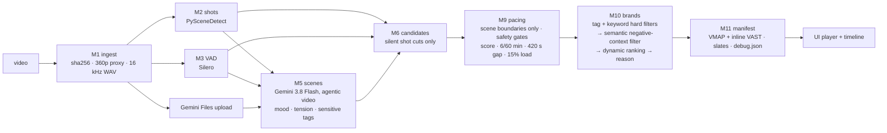

# Context-aware ad breaks for Bengali drama

Ingest a long-form episode, segment it into semantic scenes, pick the cuts where an ad break is safe and natural,
match each break to the most fitting brand from a synthetic catalogue (with `negative_contexts` as a **hard** block),
and emit a **VMAP 1.0.1 / VAST 4.2** manifest plus a player that actually cuts to the ad and resumes.

## Architecture



Principle: **deterministic gates first → AI for judgement → hard rules last.** A break is only ever considered at a
shot cut that sits in real silence (never mid-sentence) and at a scene boundary. Sensitive scenes on either side of
the cut, or a cliffhanger just before it, reject the break outright. Brands are loaded only from the catalogue file,
so a 9th brand works with zero code changes.

| Purpose | Model |
|---|---|
| Scene understanding (video, agentic) | `gemini-3.8-flash` |
| Brand negative-context check, ranking, reasons | `gemini-3.8-flash` (TypeSafe Jev when a key is provided) |
| Shots / speech | PySceneDetect `AdaptiveDetector` / Silero VAD 6.2.3 |

## Run it

Full local setup (prerequisites, keys, sample videos, UI walkthrough, Docker, troubleshooting): **[SETUP.md](SETUP.md)**.

```bash
pip install torch --index-url https://download.pytorch.org/whl/cpu && pip install -r requirements.txt
cp .env.example .env                                      # add GEMINI_API_KEY
python -m app.cli health                                  # check ffmpeg + keys
uvicorn app.api:app --port 7860                           # UI at http://localhost:7860
python -m app.cli run --video assets/<episode>.mp4        # or CLI → runs/<sha>/vmap.xml, debug.json
```

## Tests

```bash
ruff check . && pytest -m "not live"      # offline: synthetic media + recorded/mocked AI responses
pytest -m live -s                        # hits real APIs; prints the scene table for the dev sample
```

The API test runs the whole pipeline on a synthetic video with every AI call replayed from fixtures (`MOCK=1`).

## API

`POST /api/runs` (multipart `video` or `sample_id`) → `{run_id}` · `GET /api/runs/{id}/events` (SSE) ·
`GET /api/runs/{id}` · `GET /api/runs/{id}/vmap.xml` · `GET /api/runs/{id}/debug.json` ·
`POST /api/runs/{id}/rematch` (re-runs pacing → brands → manifest from cache, seconds) ·
`GET|POST /api/brands` · `POST /api/brands/upload`

## Docker

`docker build -t hoichoi-adbreaks . && docker run --rm -p 7860:7860 --env-file .env hoichoi-adbreaks` (see SETUP.md).

## Scope notes

Transcription (M4) and the Jev decision stage (M8) are placeholders that log a warning; breaks are scored on scene,
pause and tension features. Decisions and their rationale are in [DECISIONS.md](DECISIONS.md).
